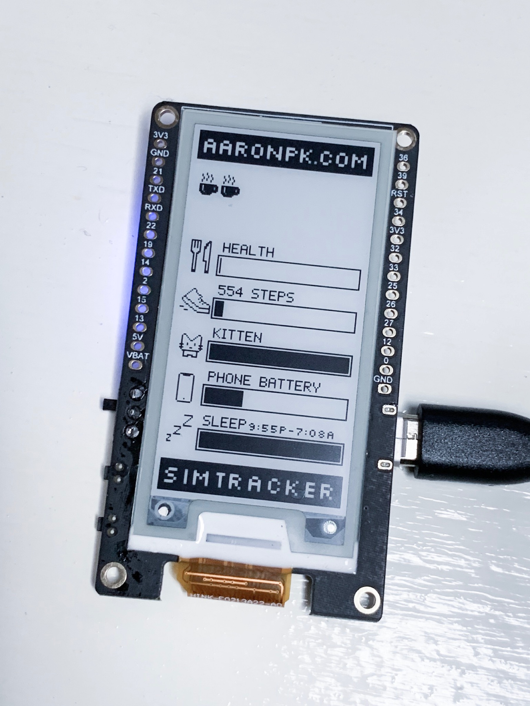

Wifi Badge
==========

This project will load an image from a web server and display it on an TTGO T5 ESP32 display.

## Badge

The file in "badge" is an Arduino project that downloads an image and writes all the pixels to the e-paper display.

You'll need to install the GxEPD library into to your Arduino environment:

* [GxEPD](https://github.com/lewisxhe/GxEPD)

## Server

The file in "web" will convert a png image to a byte stream that the badge reads from.
You will need to generate a greyscale png image of the appropriate dimensions for the display.

